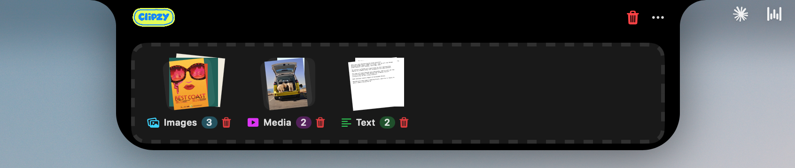
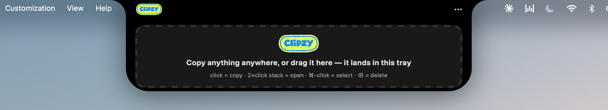
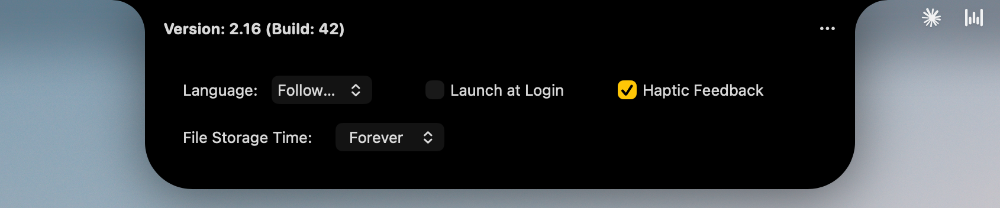

# Clipzy

**Your Mac's notch was just sitting there doing nothing. Now it's the fastest clipboard tray you'll ever use.**

[](./LICENSE)
[](#-install)
[](#-building-from-source)


<p align="center">
  
</p>

## What is this thing

Every Mac with a notch has this awkward black cutout at the top of the screen that Apple never really gave you a good reason to use. Clipzy fixes that.

Copy anything, anywhere on your Mac, and it shows up in a tray tucked right into the notch. Text, images, files, screenshots, whatever you just hit `⌘C` on. You can also just drag a file straight up and drop it in. It sits there, sorted, ready to grab again whenever you need it, and it never once leaves your machine.

Think of it as a shelf for your clipboard that lives in the one part of your screen you weren't using anyway.

## How it works

Nothing complicated going on under the hood, and that is kind of the point.

1. **Clipzy watches your clipboard.** Copy something normally, the usual `⌘C` you already do a hundred times a day, and a copy quietly lands in the tray.
2. **Or just drag stuff in.** Drag a file, an image, a screenshot, anything, up toward the notch and drop it. It gets caught and stored right there.
3. **Everything gets sorted for you.** Images, media, and text each land in their own stack, so your tray never turns into a junk drawer.
4. **Hover to peek.** Move your mouse over an item and you get a live preview, no clicking, no waiting.
5. **One click brings it back.** Click an item to copy it again. Double-click a stack to open it. Hold `⌘` and click to select more than one.
6. **It cleans up after itself.** Set how long items should stick around (an hour, a day, forever) and Clipzy handles the rest.

That's the whole thing. No accounts, no syncing to a server, no subscription. It runs locally and stays out of your way until you need it.

## 🌟 Key Features

- [x] Copy anything, from anywhere, and it lands in the notch automatically
- [x] Drag and drop files straight onto the notch
- [x] Auto-sorts everything into Images, Media, and Text stacks
- [x] Hover for an instant live preview, no extra clicks
- [x] Click to copy, double-click a stack to open it, `⌘`-click to multi-select
- [x] Configurable file retention (an hour, a day, or forever)
- [x] Works alongside your existing menu bar managers
- [x] Open AirDrop directly from the notch
- [x] Fully open source and 100% privacy-focused, nothing leaves your Mac
- [x] Free, forever, if you build it yourself

## 👀 See it in action

<table>
<tr>
<td width="50%">

**Drag and drop, straight to the notch**


</td>
<td width="50%">

**Everything sorted into stacks**


</td>
</tr>
<tr>
<td width="50%">

**Hover to see a live preview**


</td>
<td width="50%">

**Hover to read text without opening it**


</td>
</tr>
<tr>
<td width="50%">

**Up close**


</td>
<td width="50%">

**Simple, no-nonsense settings**


</td>
</tr>
</table>

## 🚀 Install

Grab the latest build from [Releases](https://github.com/gloriandesigns-dev/clipzy/releases), unzip it, drag `Clipzy.app` into your `Applications` folder, and open it.

Since it's not notarized through the App Store, macOS will show a security warning the first time. Here's how to get past it:

1. Right-click (or Control-click) `Clipzy.app` in Applications
2. Choose **Open**
3. Click **Open** again in the dialog that pops up

After that first launch, it opens normally every time, just like anything else.

## 🔨 Building from Source

If you'd rather build it yourself (or the Release isn't out yet), here's how.

### Prerequisites
- macOS with Xcode installed
- Xcode Command Line Tools

### Quick build (for daily use)

```bash
git clone https://github.com/gloriandesigns-dev/clipzy.git
cd clipzy

xcodebuild -project Clipzy.xcodeproj \
  -scheme Clipzy \
  -configuration Release \
  clean build \
  CODE_SIGN_IDENTITY="-" \
  CODE_SIGNING_REQUIRED=NO \
  CODE_SIGNING_ALLOWED=NO

cp -R ~/Library/Developer/Xcode/DerivedData/Clipzy-*/Build/Products/Release/Clipzy.app ~/Applications/
open ~/Applications/Clipzy.app
```

That's it. This builds a release-optimized, self-signed copy of the app you can use every day. No Apple Developer account needed.

### For development

Prefer working in Xcode directly? Open the project and hit run:

```bash
open Clipzy.xcodeproj
```

Then build and run with `⌘R`.

## ❓ FAQ

**Does this send my clipboard data anywhere?**
No. Everything stays on your Mac. There's no server, no analytics, no network calls tied to your clipboard content.

**Do I need a notch for this to work?**
It's built around the notch, so it's designed for MacBooks that have one (14" / 16" MacBook Pro 2021+, 15" MacBook Air 2023+, and newer). It should still install and run on other Macs, but the whole point is that little black cutout, so the experience is best where the notch actually exists.

**Will this slow my Mac down?**
It's a lightweight menu bar-style app, not a background daemon doing heavy lifting. It should sit at a few MB of memory and close to nothing on CPU when idle.

## 🧑‍⚖️ License

Released under the [MIT License](./LICENSE). Do whatever you want with it, just keep the license notice around.

## 🥰 Credits

Clipzy started life as a fork of [**NotchDrop**](https://github.com/Lakr233/NotchDrop) by Lakr233, released under the MIT license. Massive thanks to the original project for the foundation and to [NotchNook](https://lo.cafe/notchnook) for the idea that got this whole space started. Clipzy builds on that base with its own direction, sorting, previews, and polish.

## ⭐ If this saved you a few clicks

Consider dropping a star. It genuinely helps more people find it, and it costs you nothing but a click, which feels appropriate for an app about clicks.

---

Built for people who are tired of losing what they just copied. 

- Made by Love & Curiosity, Glorian

